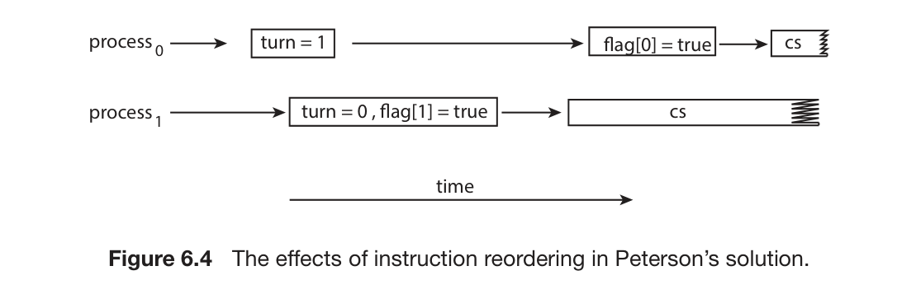
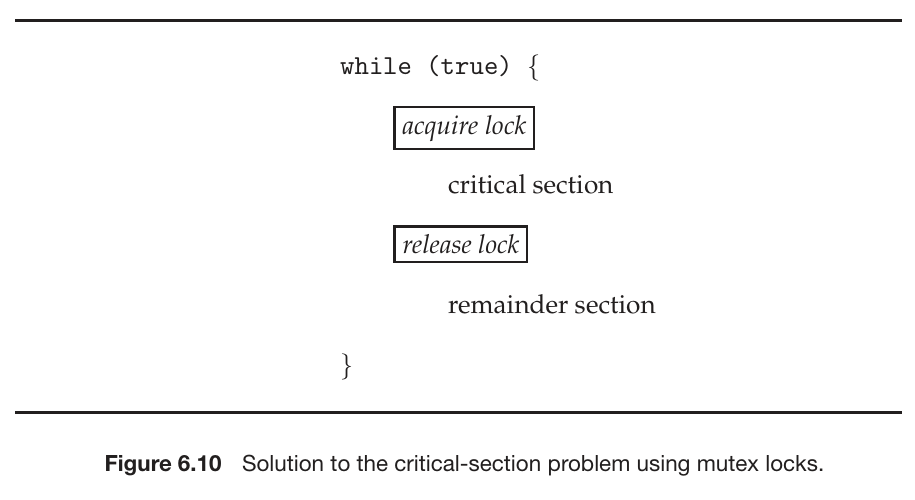
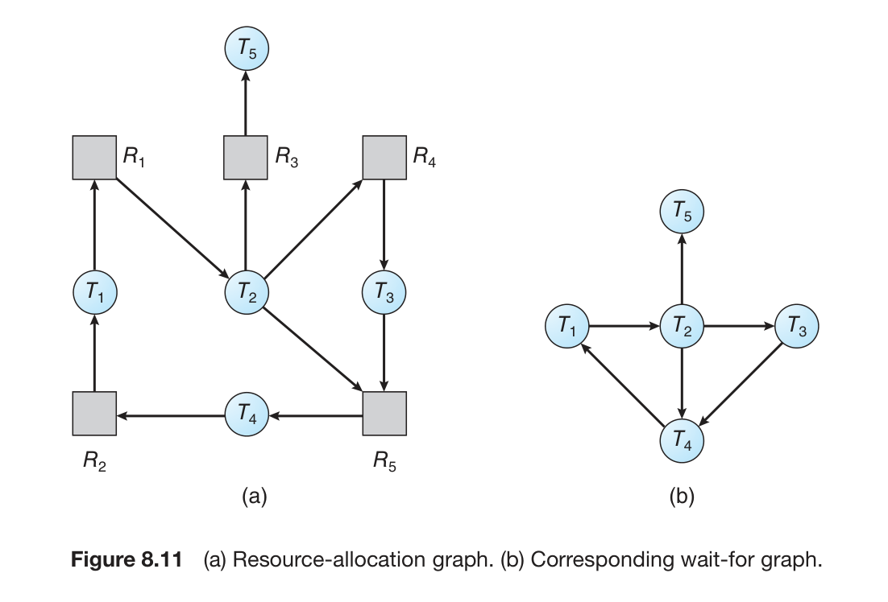
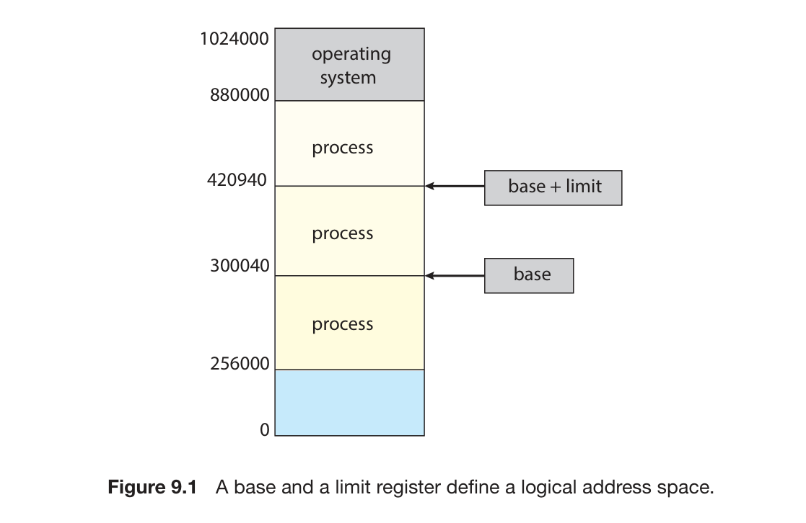
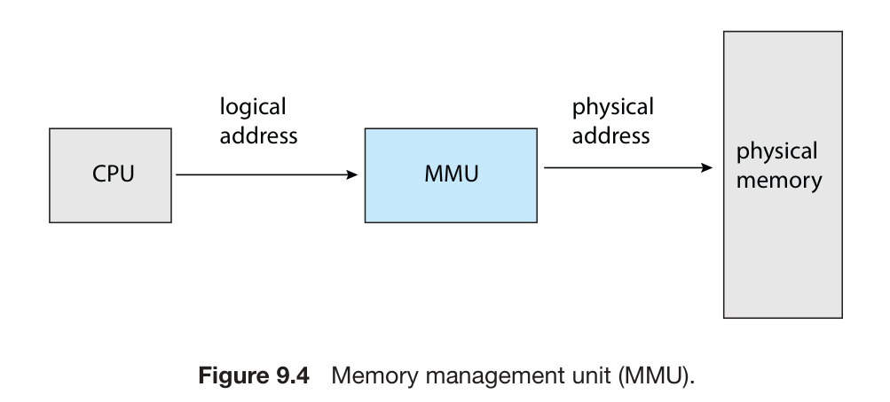
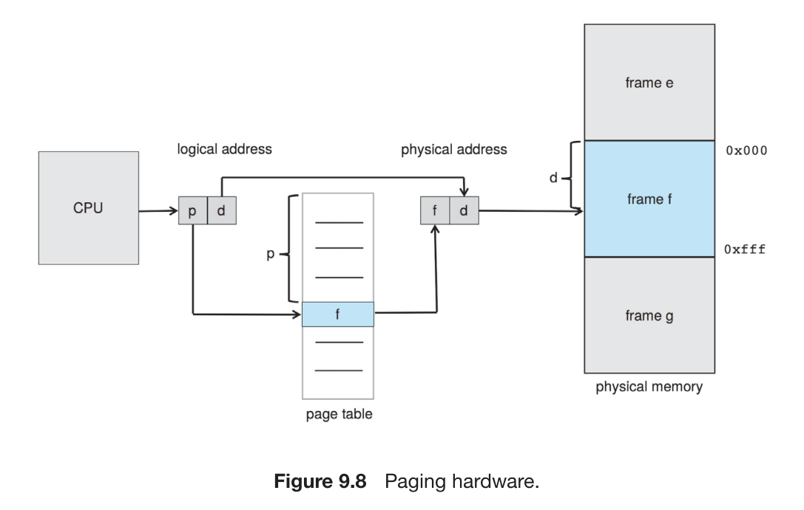

## **Chapter 6 : Synchronization Tools**

This chapter focuses on various tools used for **synchronizing processes**. Synchronization tools control access to shared data to avoid **race conditions**. Their incorrect use can lead to poor system performance, including **deadlock**.

**Concurrent Process**

A **concurrent process** refers to multiple processes or threads whose execution **overlaps in time**. This can happen on a single processing core by rapidly switching the CPU between them or on a multicore system where they can run **simultaneously** (parallelism),. Such systems consist of a collection of concurrently executing processes.

**Cooperating Process**

A **cooperating process** is a process that **can affect or be affected by other processes** executing in the system. They may share data.

### **6.1 Background**

This section introduces how concurrent or parallel execution can cause issues with the integrity of data shared by several processes.

*   **Producer-Consumer Code**: This is a classic synchronization problem used to illustrate concurrent processes sharing data,. It involves **producer processes** creating data items and putting them into a **shared buffer**, and **consumer processes** taking items from the buffer,.
*   **Race Condition**: A situation where the **outcome of operations depends on the unpredictable order of execution** of multiple processes or threads accessing shared data. This can lead to data inconsistency or corrupted shared data values,.

### **6.2 Critical Section Problem**

This is the problem of designing a protocol for processes to **safely access shared data**. The **critical section** is the segment of code where a process accesses shared data,. The goal is to ensure that **when one process is in its critical section, no other process is allowed to execute in its critical section**. Solutions must satisfy three requirements,:

*   **Mutual Exclusion**: Ensures that **only one process** is executing in its **critical section** at any given time,.
*   **Progress**: If no process is in its critical section and some want to enter, the selection of the next process to enter **cannot be postponed indefinitely**,.
*   **Bounded waiting**: There is a **limit on the number of times** other processes can enter their critical sections after a process requests entry and before its request is granted,.

### **6.3 Peterson's Solution**

This is a classic **software-based solution** to the critical-section problem for two processes. It provides a good algorithmic description but is **not guaranteed to work correctly on modern computer architectures** due to potential instruction reordering. It aims to satisfy mutual exclusion, progress, and bounded waiting.

```
while (true) {
    flag[i] = true;
    turn = j;
    while (flag[j] && turn == j)
        ;
    /* critical section */
    flag[i] = false;
    /*remainder section */
}
```
> Figure 6.3: The structure of process $P_i$ in Peterson’s solution.



*   Figure 6.4: Illustrates the **effects of instruction reordering** in Peterson’s solution, showing how it could potentially allow both processes to be in their critical sections simultaneously.

### **6.4 Hardware Support for Synchronization**

Modern computer systems provide special **hardware** features that help implement synchronization mechanisms,. These can be used directly or form the basis for higher-level tools.

*   **6.4.1 Memory Barriers**: Hardware or software constructs that **enforce a specific ordering of memory operations** (loads and stores) relative to one another. They ensure memory modifications are visible to other processors. They are typically low-level and used by kernel developers,.
*   **6.4.2 Hardware Instructions**,: Special, **atomic CPU instructions** designed for synchronization,. Examples include `test_and_set()` and `compare_and_swap()` (CAS),. These operations are performed as a single, **uninterruptible unit**.

``` 
boolean test and set(boolean *target) {
    boolean rv = *target;
    *target = true;

    return rv;
}
```
> Figure 6.5: Shows the definition of the atomic `test_and_set()` instruction.

### **Atomic Process**

The sources refer to **atomic operations**. An operation is **atomic** if it appears to occur instantaneously and indivisibly; either it completes fully, or it doesn't happen at all. This is crucial for synchronization primitives like `test_and_set()`, `compare_and_swap()`, and semaphore `wait()`/`signal()` to ensure correctness.

```
int compare and swap(int *value, int expected, int new value) {
    int temp = *value;

    if (*value == expected)
        *value = new value;

    return temp;
}
```
> Figure 6.7: The definition of the atomic compare and swap() instruction.

```
int compare and swap(int *value, int expected, int new value) {
    int temp = *value;

    if (*value == expected)
        *value = new value;

    return temp;
}
```
> Figure 6.7: The definition of the atomic `compare_and_swap()` instruction.

```
while (true) {
    while (compare and swap(&lock, 0, 1) != 0)
        ; /* do nothing */

    /* critical section */

    lock = 0;

    /* remainder section */
}
```

> Figure 6.8: Shows how to implement **mutual exclusion** using the `compare_and_swap()` instruction.

```
while (true) {
    waiting[i] = true;
    key = 1;
    while (waiting[i] && key == 1)
        key = compare and swap(&lock,0,1);
    waiting[i] = false;

    /* critical section */

    j = (i + 1) % n;
    while ((j != i) && !waiting[j])
        j = (j + 1) % n;

    if (j == i)
        lock = 0;
    else
        waiting[j] = false;

    /* remainder section */
}
```
> Figure 6.9: Bounded-waiting mutual exclusion with compare and swap().

### **Mutex Locks**

**Mutex locks** (short for **mutual exclusion**) are higher-level software tools used to **protect critical sections** and prevent **race conditions**,. A process must **acquire** the lock before entering a critical section and **release** it upon exiting. Calls to `acquire()` and `release()` must be atomic. They are a common source of **deadlock** if used incorrectly.

*   **Mutual Exclusion**: (See above) Mutex locks are used to enforce this property.



*   Figure 6.10: Illustrates the general structure of using `acquire()` and `release()` functions with a mutex lock.

The definition of acquire() is as follows:
```
acquire() {
    while (!available)
        ; /* busy wait */
    available = false;
}
```
The definition of release() is as follows:
```
release() {
    available = true;
}
```

**Lock Contention**

**Lock contention** happens when **multiple threads or processes simultaneously attempt to acquire a mutex lock** that is already held by another. This forces some threads to wait and can decrease the performance of concurrent applications, especially under high contention.

**What is meant by "short duration"?**
This term, used when discussing spinlocks, refers to holding a lock for a **minimal amount of time**. The general rule is to use a spinlock if the lock will be held for a duration **less than two context switches**. Holding locks for short durations in general helps reduce **lock contention** and improve concurrency,.

### **6.6 Semaphores**

A **Semaphore** is a synchronization tool, typically an **integer variable**, accessed only through two standard, **atomic operations**: `wait()` (decrements the value) and `signal()` (increments the value),. They are used to control access to a finite number of resources or synchronize the execution flow of processes,. They can be **counting** (value over an unrestricted domain) or **binary** (value 0 or 1),. Binary semaphores behave similarly to mutex locks. When a process calls `wait()` and the semaphore value is not positive, the process **suspends itself** and is placed in a waiting queue, avoiding busy waiting.

*   The `wait()` and `signal()` operations must be executed **atomically**,. In multicore systems, this requires hardware support like `compare_and_swap()` or spinlocks.

### **6.7 Monitors**

A **Monitor** is a **higher-level synchronization construct**,. It is an **abstract data type (ADT)** that encapsulates **shared data, the procedures/functions** that operate on that data, and the necessary synchronization mechanisms,. The monitor ensures that **only one thread can execute inside the monitor at a time**,. Monitors often use **condition variables** to allow threads to wait for specific conditions to become true,. They were introduced to help avoid programming errors common with semaphores and mutex locks.

*   **6.7.1 Monitor Usage**: Describes how the monitor construct is used by grouping shared data and the procedures that access it, enforcing synchronized access.
*   **Abstract Data Type - ADT**: Monitors are described as an ADT meaning they package data and operations together, controlling how the data is accessed.
*   **Function-based Solution $\to$ Monitor**: Monitors provide procedures or functions, that processes call to interact with the shared data, with the monitor ensuring only one process is executing within its functions at a time.

```
monitor monitor name
{
    /* shared variable declarations */
    function P1 ( . . . ) {
        . . .
    }
    function P2 ( . . . ) {
        . . .
    }
        .
        .
        .
    function Pn ( . . . ) {
        . . .
    }

    initialization code ( . . . ) {
        . . .
    }
}
```
> Figure 6.11: Pseudocode syntax of a monitor.

**6.7.2 Implementing a Monitor using Semaphores**,
Monitors can be implemented using semaphores,. This involves using a binary semaphore (typically called `mutex`) to provide **mutual exclusion** for entry into the monitor.

*   **How Monitors are used for reasoning?**: While not explicitly detailed in the sources, the context implies that monitors, by providing a higher level of abstraction and grouping synchronization mechanisms with the data they protect, make it **easier to design correct concurrent programs** and are less prone to the timing errors that can occur with raw semaphores or mutexes. This structured approach aids in **reasoning** about concurrency correctness by enforcing necessary constraints automatically.

**6.7.3 Resuming Process within a Monitor**
Within a monitor, processes waiting on **condition variables** can be resumed. When a condition is signaled (e.g., using a `signal()` or `broadcast()` operation on a condition variable), one or more processes waiting on that specific condition variable may be moved from a waiting queue to a state where they can potentially re-enter the monitor and check their condition,.

**6.8 Liveness**

**Liveness** refers to properties that ensure a process or thread makes progress and does not wait indefinitely. Using synchronization tools can potentially lead to **liveness failures**,. Failures include violating the progress and bounded-waiting criteria.

*   **6.8.1 Deadlocks**: A major type of **liveness failure**,. Occurs when a set of processes are **each waiting for an event** (like a resource or lock) that can **only be caused by another process in that same set**. Mutex locks and semaphores are common sources of deadlock,.
*   **6.8.2 Priority Inversion**: A **scheduling challenge** that is a form of liveness problem. It happens when a **higher-priority process has to wait** for a **lower-priority process** that holds a resource the higher-priority process needs. This can block the higher-priority process.


## **Chapter 7 : Synchronization Examples**

**Chapter 7 : Synchronization Examples** applies the synchronization tools discussed in **Chapter 6** to solve classic concurrency problems. **Chapter 6 : Synchronization Tools** focuses on various tools for synchronizing processes to prevent **race conditions** when accessing shared data.

**Problems in Chapter 6** (and thus relevant to Chapter 7): Chapter 6 introduces the concept of **race conditions**, which occur when multiple processes access and manipulate the same data concurrently, and the outcome depends on the unpredictable order of access. This can lead to data inconsistency. The problems in Chapter 7 are examples of how concurrent access to shared resources can lead to such issues and how synchronization tools are used to solve them.

These classic synchronization challenges are commonly used to test new synchronization mechanisms. Chapter 7 focuses on three main **problems**:

*   **Bounded-Buffer**
*   **Readers-Writers**
*   **Dining Philosophers**

### **7.1.1 The Bounded-Buffer Problem**

This problem is a common example used to illustrate the power of synchronization primitives. It involves **producer processes** that create data items and place them into a **shared buffer**, and **consumer processes** that take items from the buffer. The issue is coordinating access to this **shared buffer** to prevent **race conditions**. The source mentions using semaphores (`empty`, `full`, `mutex`) to synchronize access to this buffer.

```
while (true) {
    . . .
    /* produce an item in next produced */
    . . .
    wait(empty);
    wait(mutex);
    . . .
    /* add next produced to the buffer */
    . . .
    signal(mutex);
    signal(full);
}
```
> Figure 7.1: Shows the structure of the producer process.

```
while (true) {
    wait(full);
    wait(mutex);
    . . .
    /* remove an item from buffer to next consumed */
    . . .
    signal(mutex);
    signal(empty);
    . . .
    /* consume the item in next consumed */
    . . .
}
```
> Figure 7.2: Shows the structure of the consumer process.

### **7.1.2 The Readers–Writers Problem**

This problem involves processes sharing a data resource, such as a database. Some processes, called **readers**, only read the data, while others, called **writers**, update (read and write) the data. The constraint is that while multiple **readers** can access the data concurrently without issue, a **writer** must have exclusive access; no other process (neither reader nor writer) can access the data while a writer is writing.
The problem has variations, including:

*   **First Readers–Writers Problem**: Requires that no reader be kept waiting unless a writer has already obtained permission to use the shared object.
*   **Second Readers–Writers Problem**: Requires that, once a writer is ready, that writer perform its write as soon as possible; if a writer is waiting, no new readers may start reading.

Solutions to these problems may result in starvation. Some systems provide **reader–writer locks** as a synchronization tool.

```
while (true) {
    wait(rw_mutex);
    . . .
    /* writing is performed */
    . . .
    signal(rw_mutex);
}
```
> Figure 7.3: Shows the code for a writer process.

```
while (true) {
    wait(mutex);
    read count++;
    if (read count == 1)
        wait(rw mutex);
    signal(mutex);
    . . .
    /* reading is performed */
    . . .
    wait(mutex);
    read count--;
    if (read count == 0)
        signal(rw mutex);
    signal(mutex);
}
```
> Figure 7.4: Shows the code for a reader process.

### **7.1.3 The Dining Philosophers Problem**

This is a classic synchronization problem used to represent the need to allocate several resources among several processes in a deadlock-free and starvation-free manner. It involves a set of philosophers who alternate between thinking and eating, sitting around a table with chopsticks between each pair of philosophers. To eat, a philosopher needs two chopsticks. The problem arises when all philosophers become hungry and simultaneously pick up one chopstick, leading to a situation where each is waiting for the other chopstick held by a neighbor, which can cause **deadlock**. Solutions aim to avoid both deadlock and starvation.

```
while (true) {
    wait(chopstick[i]);
    wait(chopstick[(i+1) % 5]);
    . . .
    /* eat for a while */
    . . .
    signal(chopstick[i]);
    signal(chopstick[(i+1) % 5]);
    . . .
    /* think for awhile */
    . . .
}
```
> Figure 7.6: Shows a semaphore-based structure for a philosopher. This simple solution can lead to deadlock.

```
monitor DiningPhilosophers
{
    enum {THINKING, HUNGRY, EATING} state[5];
    condition self[5];
    
    void pickup(int i) {
        state[i] = HUNGRY;
        test(i);
        if (state[i] != EATING)
            self[i].wait();
    }

    void putdown(int i) {
        state[i] = THINKING;
        test((i + 4) % 5);
        test((i + 1) % 5);
    }

    void test(int i) {
        if ((state[(i + 4) % 5] != EATING) &&
            (state[i] == HUNGRY) &&
            (state[(i + 1) % 5] != EATING)) {
                state[i] = EATING;
                self[i].signal();
            }
    }

    initialization code() {
        for (int i = 0; i < 5; i++)
        state[i] = THINKING;
    }
}
```
> Figure 7.7: Shows a monitor-based solution structure for the dining philosophers problem. Monitors provide a higher-level construct for solving this problem.


## **Chapter 8 : Deadlocks**

**Chapter 8 : Deadlocks** covers methods for handling deadlocks. Deadlock is a problem that can arise in a system with multiple active asynchronous processes and is a form of liveness failure discussed briefly in Chapter 6.

**Process**: A **process** is a program in execution. It is the unit of work in a system.
**Thread**: A **thread** is a basic unit of CPU utilization. Threads belonging to the same process share many of the process resources, including code and data.

### **8.1 System Model** 

**System Model** describes the framework where a system has a finite number of resources of various types that are distributed among competing threads. Resources can include CPU cycles, files, and I/O devices, as well as synchronization tools like mutex locks and semaphores. Threads must **request** a resource before using it and **release** it after using it. A set of threads is in a deadlocked state when every thread in the set is waiting for an event that can be caused only by another thread in the set.

### **8.2 Deadlock in Multithreaded Application** 

**Deadlock in Multithreaded Application** illustrates how deadlock can occur in multithreaded programs, for example, using POSIX mutex locks. A deadlock can happen if threads attempt to acquire locks in different orders. This demonstrates that deadlock is possible but doesn't always occur, depending on the CPU scheduler's decisions.

**8.2.1 Livelock** 

One of the sources mentions **livelock** as a new section in Chapter 8 and discusses it as a liveness hazard. However, the provided excerpts do not contain specific details or an explanation of livelock under this section number.

### **8.3 Deadlock Characterization**

**Deadlock Characterization** examines the conditions that must hold for a deadlock to occur.

**8.3.1 Necessary Conditions**

A deadlock situation can arise if and only if four conditions hold simultaneously in a system. These conditions are:

1.  **Mutual exclusion**: At least one resource must be held in a nonsharable mode, meaning only one thread can use it at a time.
2.  **Hold and wait**: A thread must be holding at least one resource and waiting to acquire additional resources that are currently held by other threads.
3.  **No preemption**: Resources cannot be preempted; they can only be released voluntarily by the thread holding them, after that thread has completed its task.
4.  **Circular wait**: A set of threads {$T_0, T_1, ..., T_n$} must exist such that $T_0$ is waiting for a resource held by $T_1$, $T_1$ is waiting for a resource held by $T_2$, ..., $T_{n-1}$ is waiting for a resource held by $T_n$, and $T_n$ is waiting for a resource held by $T_0$.

**8.3.2 Resource Allocation Graph** 

Deadlocks can be precisely described using a directed graph. This graph includes vertices representing all active threads ($T$) and all resource types ($R$).

*   A request edge is drawn from a thread T_i to a resource type $R_j$ ($T_i$ $\to$ $R_j$) if T_i is requesting an instance of $R_j$.
*   An assignment edge is drawn from a resource type $R_j$ to a thread $T_i$ ($R_j$ $\to$ $T_i$) if an instance of $R_j$ is allocated to $T_i$.

If a **resource-allocation graph** does not have a cycle, then the system is not in a deadlocked state. If there is a cycle, the system *may* or *may not* be in a deadlocked state. This observation is important for dealing with the deadlock problem. Figure 8.11 shows a resource-allocation graph and its corresponding wait-for graph, illustrating how cycles relate to deadlock.

### **8.4 Methods for Handling Deadlocks**

There are three general approaches to dealing with the deadlock problem:

1.  Ignore the problem.
2.  Use a protocol to **prevent** or **avoid** deadlocks.
3.  Allow deadlocks to occur, **detect** them, and **recover**.

Most operating systems, including Linux and Windows, use the first approach, leaving it to developers to prevent deadlocks, typically using methods from the second solution. Database systems sometimes use the third approach, detecting and recovering from deadlocks.

**8.5 Deadlock Prevention** 
### 
This approach ensures that at least one of the four **Necessary Conditions** for deadlock cannot hold. These methods prevent deadlocks by constraining how resource requests can be made.

*   **8.5.1 Mutual Exclusion**: Cannot generally be prevented because some resources are nonsharable.
*   **8.5.2 Hold and Wait**: Can be prevented by requiring a thread to request all its resources before starting execution or requiring it to release all current resources before requesting new ones. These methods can lead to **Low Device Utilization** and **starvation**.
*   **8.5.3 No Preemption**: Can be prevented by preempting resources held by a thread if it requests a resource it cannot get immediately. This is often applied to resources whose state can be easily saved and restored, but not typically to mutex locks and semaphores.
*   **8.5.4 Circular Wait**: Can be prevented by imposing a total ordering of all resource types and requiring threads to request resources in increasing order.

### **8.6 Deadlock Avoidance**

This approach uses a protocol to prevent deadlocks by requiring the operating system to have information about the resources a thread will need. A deadlock-avoidance algorithm dynamically examines the resource-allocation state to ensure that a circular-wait condition can never exist. Possible side effects of deadlock prevention/avoidance methods include **Low Device Utilization** and **Reduced System Throughput**.

*   **8.6.1 Safe State**: A state is **safe** if the system can allocate resources to each thread (up to its maximum needs) in some order and still avoid a deadlock. A safe state is defined by the existence of a **safe sequence** of threads. A safe state is not a deadlocked state, but an unsafe state may lead to a deadlock. Avoidance algorithms ensure the system always remains in a safe state.
*   **8.6.2 Resource Allocation Graph Algorithm**: For systems with a single instance of each resource type, a variant of the resource-allocation graph is used. This involves a **Claim edge** (dashed line) indicating a future request. When a resource is requested, the claim edge converts to a request edge. The allocation is granted only if it doesn't create a cycle in the graph, as a cycle in this specific case (single instance) indicates an unsafe state.

    *   **Claim edge**: A dashed edge $T_i$ $\to$ $R_j$ indicating that thread $T_i$ may request resource $R_j$ in the future.
    *   **Assignment**: When a resource $R_j$ is released by $T_i$, the assignment edge $R_j$ $\to$ $T_i$ is reconverted to a claim edge $T_i$ $\to$ $R_j$.
*   **8.6.3 Banker's Algorithm**: This algorithm is a deadlock-avoidance method for systems with multiple instances of each resource type. It requires threads to declare their maximum resource needs in advance.

    *   **Data Structure**: The algorithm requires several data structures:

        *   **Available**: A vector indicating the number of available resources of each type.
        *   **Max**: A matrix indicating the maximum demand of each thread for each resource type.
        *   **Allocation**: A matrix indicating the number of resources of each type currently allocated to each thread.
        *   **Need**: A matrix indicating the remaining resources each thread still needs (Max minus Allocation).
    *   **8.6.3.1 Safety Algorithm**: An algorithm that determines if a given resource-allocation state is safe. It involves finding a sequence of threads that can complete execution by satisfying their remaining needs with the available resources. If no such sequence exists, the state is unsafe.

### **8.7 Deadlock Detection**

If a system does not prevent or avoid deadlocks, it may provide an algorithm to detect if a deadlock has occurred.



*   **8.7.1 Single Instances of Each Resource Type**: For systems with one instance of each resource type, a **wait-for graph** can be used. This graph is derived from the resource-allocation graph, where an edge $T_i$ $\to$ $T_j$ exists if thread $T_i$ is waiting for thread $T_j$ to release a resource. A deadlock exists if and only if the **wait-for graph** contains a cycle. Figure 8.11 shows an example of a resource-allocation graph and its corresponding wait-for graph.
*   **8.7.3 Deletion-Algorithm Usage**: The frequency of invoking the detection algorithm depends on how often deadlocks are likely and how many threads would be affected. Database systems often use periodic detection by searching for cycles in the **wait-for graph**.

**Self Reading**: The source mentions "Self Reading" in the context of database systems using deadlock detection and recovery. This section describes how databases manage deadlock through periodic detection and selecting a victim transaction to abort and roll back.

### **8.8 Recovery from Deadlock**

When a detection algorithm finds a deadlock, the system can automatically recover. The two main options are aborting processes or preempting resources.

*   **8.8.1 Process and Thread Termination**: This method breaks the deadlock cycle by aborting one or more processes or threads. Resources allocated to terminated processes are reclaimed. Options include aborting all deadlocked processes (expensive) or aborting one process at a time until the deadlock is broken (incurs overhead for repeated detection). If terminating one process at a time, several factors may affect which process is chosen as the victim.

    *   **From Page-342** : **Many factors may affect which process is chosen, including:**

        *   **What the priority of the process is**.
        *   **How long the process has computed and how much longer the process will compute before completing its designated task**.
        *   **How many and what types of resources the process has used**.
        *   **How many more resources the process needs in order to complete**.
        *   **How many processes will need to be terminated**.

*   **8.8.2 Resource Preemption**: This method involves taking resources from deadlocked processes and giving them to others until the cycle is broken. Issues include selecting a victim, rolling back the process to a safe state, and preventing starvation.


## **Chapter 9 : Main Memory**

Memory is central to the operation of a modern computer system. It consists of a large array of bytes, each with its own address. The CPU fetches instructions from memory and accesses data from memory. Instructions and data being used by the CPU must be in main memory for the CPU to access them directly. The memory unit sees only a stream of memory addresses and doesn't know how they were generated or what they are for. Memory management algorithms deal with managing memory, and they often require hardware support, leading to closely integrated hardware and operating-system memory management. The main memory is usually a volatile storage device that loses its contents when power is lost.



Figure 9.1 illustrates a **memory layout for a multiprogramming system** using **a base and a limit register to define a logical address space**. In this scheme, the **base register holds the smallest legal physical memory address**, and the **limit register specifies the size of the range**. For example, if the base is 300040 and the limit is 120900, legal addresses are from 300040 through 420939. This setup helps ensure that each process has a separate memory space, protecting processes from each other.

### **9.1 Address Binding**

To run a program, it must be brought into memory and placed within the context of a process. As the process executes, it accesses instructions and data from memory. Address binding refers to how symbolic (or virtual) memory addresses in a program are linked to actual physical addresses in memory. This binding can happen at different times:

*   **Compile Time**: If memory locations are known beforehand, the program can be compiled into absolute code. If the starting address changes later, the program must be recompiled.
*   **Execution Time**: If the process can be moved during its execution from one memory segment to another, binding must be delayed until run time. Most operating systems use this method, which requires special hardware support.

**9.1.3 Logical Versus Physical Address Space**

An address generated by the CPU is a **logical address**. An address seen by the memory unit (the one loaded into the memory-address register) is a **physical address**.
When address binding happens at compile or load time, the logical and physical addresses are identical. However, the execution-time address-binding scheme results in different logical and physical addresses. In this case, the logical address is often called a **virtual address**. The set of all logical addresses generated by a program is a **logical address space**, and the set of all physical addresses corresponding to these is a **physical address space**.



Figure 9.4 shows the **Memory Management Unit (MMU)**. The MMU is a hardware device that performs the run-time mapping from virtual (or logical) addresses to physical addresses.

### **9.3 Paging**

Paging is a **memory-management scheme that allows a process’s physical address space to be non-contiguous**. It avoids external fragmentation and the need for compaction, problems associated with contiguous memory allocation. Paging is used in most operating systems because it offers numerous advantages. It is implemented through cooperation between the operating system and the computer hardware. Organizing memory according to pages provides benefits like allowing several processes to share the same physical pages.

**9.3.1 Basic Method**

The basic method of paging involves breaking physical memory into fixed-sized blocks called **frames** and breaking logical memory into blocks of the same size called **pages**. When a process needs to be executed, its pages are loaded into any available memory frames. The backing store (secondary storage) is also divided into blocks the same size as the frames or clusters of frames.
The logical address space is completely separate from the physical address space. An address generated by the CPU is divided into two parts: a **page number (p)** and a **page offset (d)**. The page number is used as an index into a **per-process page table**. The page table contains the base address of each frame in physical memory. The offset is the location within the frame being referenced.



Figure 9.8 illustrates the **Paging hardware**. It shows how the CPU generates a logical address, which is split into a page number `p` and a page offset `d`. The figure indicates that the page number `p` is used to index into the page table. The page table entry provides a frame number `f`. The page offset `d` is then combined with the frame number `f` to form the physical address `f d`, which is sent to physical memory.